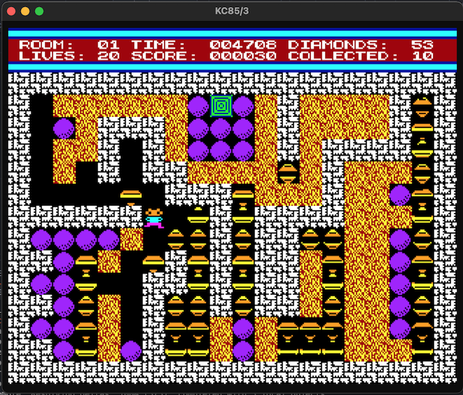
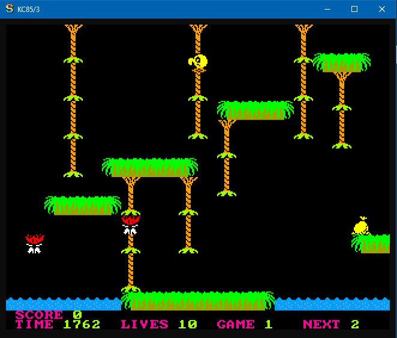
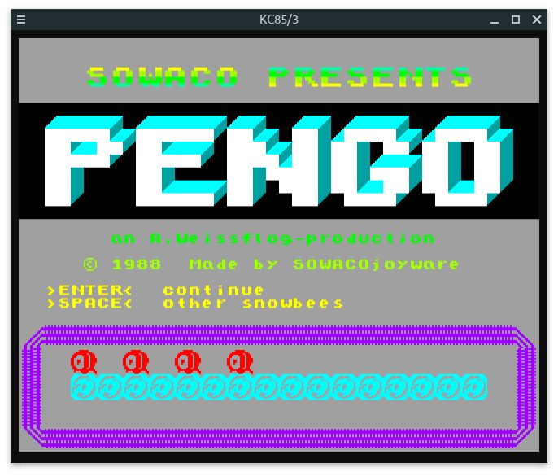
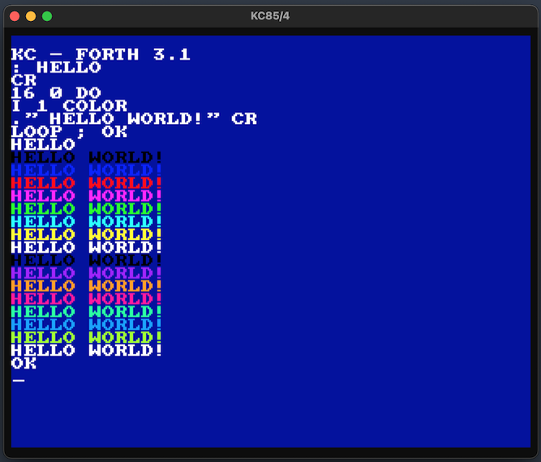

A simple KC85/2, /3 and /4 emulator for Windows, macOS and Linux, written in Zig. Uses the [sokol headers](https://github.com/floooh/sokol) for platform abstraction.

Read more about the KC85 computer series here:

- https://en.wikipedia.org/wiki/KC_85
- https://floooh.github.io/virtualkc/p010_kc85.html
- https://floooh.github.io/2017/01/14/yakc-diamond-scroll.html

Some [implementation notes](https://github.com/floooh/kc85.zig/blob/main/IMPLEMENTATION.md).

## Build

With Zig version 0.9.x, on Windows, macOS or Linux:
```
zig build
```
NOTE: For the zig dev version, try the branch ```zig-0.10.0```, this will be merged to ```main```
when Zig 0.10.0 releases.

The default debug version will usually be fast enough, to build with optimizations 
use any of:

```
zig build -Drelease-safe=true
zig build -Drelease-fast=true
zig build -Drelease-small=true
```
NOTE: On Linux you also need to install the ALSA, X11 and GL development packages.

## Build and start into KC85/2, /3 and /4

```
zig build run-kc852
zig build run-kc853
zig build run-kc854
```

Run ```zig build --help``` to see the remaining build targets.

> NOTE: when running any of the games, turn down your sound volume first. The raw square-wave sound can be a bit "aggressive". You have been warned ;)

## Run Digger

```
zig build run-kc853 -- -slot8 m022 -file data/digger3.tap
```


Press [Enter] to start a new game round, and [Esc] to continue
after you died. Use the arrows keys to navigate.

## Run Jungle
```
zig build run-kc853 -- -slot8 m022 -file data/jungle.kcc
```


Navigate with arrow keys, jump with [Space].

## Run Pengo
```
zig build run-kc853 -- -file data/pengo.kcc
```


Navigate with the arrow keys, continue running against
an ice block to push or destroy the block.

## Run FORTH on the KC85/4
```
zig build run-kc854 -- -slot8 m026 data/forth.853
```

On the KC85/4's command line, first activate the module,
and then start Forth:

```
switch 8 c1[Enter]
forth[Enter]
```
(the characters will appear uppercase, don't worry, that's normal)



## Misc Stuff

For an instant nostalgia kick, start the KC85/4:

```
zig build run-kc854
```

...and then type this into the KC85/4 command line.

Make sure your audio volume isn't silent, but **don't** turn it up *too* much!

```
save f000 f800[Enter]
```
...type anything for the name, and hit Enter again :D

